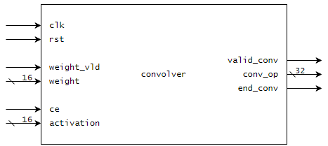
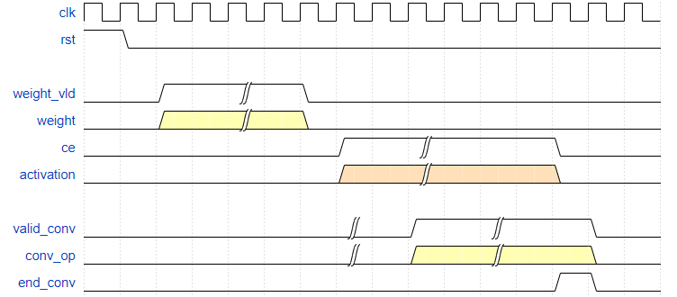
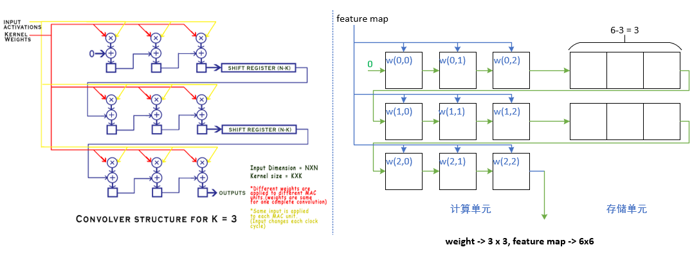
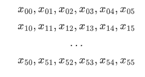
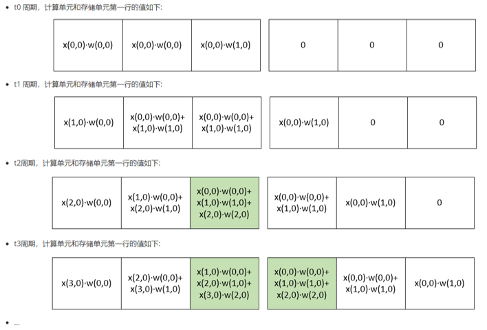
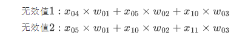
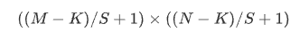
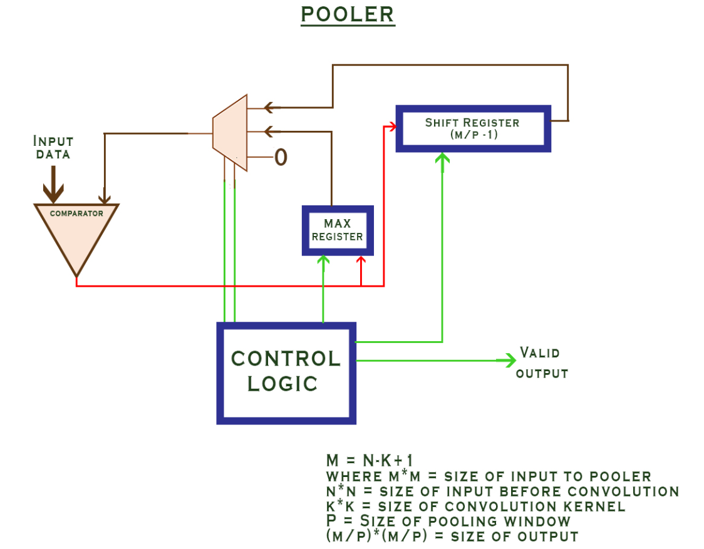

# cnn_hardware_acclerator_for_fpga

## brief

对原仓库的的代码进行了更新，修改了其中一些离谱的写法。

**原仓库**

https://github.com/sumanth-kalluri/cnn_hardware_acclerator_for_fpga

**原仓库简介**

This is a fully parameterized verilog implementation of computation kernels for accleration of the Inference of Convolutional Neural Networks on FPGAs.

## block diagram

### 1. 卷积模块

参数说明:

- FM_ROW: 特征图的行数
- FM_COL: 特征图的列数
- K: 卷积核的大小
- S: 步长，水平和垂直方向的步长相同

时序说明: 

> valid_conv的输出不是连续的,中间会有拉低的周期。

卷积模块的实现方式很直接，采用权重不动，数据流动的方式计算。

以feature_map = (6,6), weight=(3,3),stride=1为例进行说明。

假设输入的数据为： 

下面按照时序，对基本执行流程进行分析: 

图中绿色的部分便是正确的卷积计算公式中第一行计算的子式。

在t6周期，第一个绿色部分的值会传递给第二行进行计算。

**注意点:** 

每一行计算完成后，会有2个无效值(假设kernel的大小为KxK,则有K-1个无效值)，将本行的数和下一行的数参与了运算

需要从结果中剔除这样的数据。

**这种结构本质上只能计算步长为1的卷积，如果要计算步长大于1的卷积，实际上还是按照步长为1的计算，然后从结果中剔除不需要的值。( 步长为1的卷积包含步长大于1的卷积所有的结果)。**

卷积结果的维度, 输入特征图为MxN, 核为KxK, 步长为S, 输出结果维度为

### 2. 池化模块

